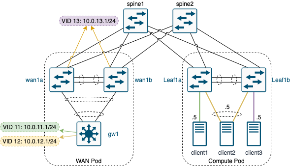

# Crawling to run

Project to find out how to start slowly in the world of automation instead of trying to automate everything and setting yourself up to fail.

## Requirements

- **Containerlab**: Tool to orchestrate a docker based lab
- **Ansible**: Main pillar of automation

## The lab



**Subnets:**

| Prefix       | Function                        |
| ------------ | ------------------------------- |
| 10.0.0.0/24  | P2P's leaf spine links          |
| 10.0.1.0/24  | P2P link for MLAG               |
| 10.0.2.0/24  | P2P link for routing redundancy |
| 10.0.3.0/24  | Other P2P's                     |
| 10.0.4.0/24  | VTEP's                          |
| 10.0.11.0/24 | VLAN 11 to test VXLAN bridging  |
| 10.0.12.0/24 | VLAN 12 to test VXLAN bridging  |
| 10.0.13.0/24 | VLAN 13 to test VXLAN routing   |

**Leaf-Spine links:**

Spine has the lower IP of the prefix

| Leaf   | Leaf interface | Spine  | Spine interface | prefix       |
| ------ | -------------- | ------ | --------------- | ------------ |
| wan1a  | Ethernet1      | spine1 | Ethernet1       | 10.0.0.0/31  |
| wan1a  | Ethernet2      | spine2 | Ethernet1       | 10.0.0.2/31  |
| wan1b  | Ethernet1      | spine1 | Ethernet2       | 10.0.0.4/31  |
| wan1b  | Ethernet2      | spine2 | Ethernet2       | 10.0.0.6/31  |
| leaf1a | Ethernet1      | spine1 | Ethernet3       | 10.0.0.8/31  |
| leaf1a | Ethernet2      | spine2 | Ethernet3       | 10.0.0.10/31 |
| leaf1b | Ethernet1      | spine1 | Ethernet4       | 10.0.0.12/31 |
| leaf1b | Ethernet2      | spine2 | Ethernet4       | 10.0.0.14/31 |

**MLAG peer links:**

| Side A | Side B | interface 1 | interface 2 | MLAG prefix | Routed prefix |
| ------ | ------ | ----------- | ----------- | ----------- | ------------- |
| wan1a  | wan1b  | Ethernet 3  | Ethernet 4  | 10.0.1.0/31 | 10.0.2.0/31   |
| leaf1a | leaf1b | Ethernet 3  | Ethernet 4  | 10.0.1.2/31 | 10.0.2.2/31   |

**Other P2P's:**

| Side A       | Side B | interface 1 | interface 2 | Side A IP        | Side B IP   |
| ------------ | ------ | ----------- | ----------- | ---------------- | ----------- |
| wan1a, wan1b | gw1    | Vlan10      | Vlan10      | VIP: 10.0.3.1/29 | 10.0.3.4/29 |

**VTEP's:**:

| Location            | IP       |
| ------------------- | -------- |
| Shared routing VTEP | 10.0.4.1 |
| wan1                | 10.0.4.2 |
| leaf1               | 10.0.4.3 |

**Endpoint:**

| Name     | access mode   | Vlan | IP        | switch         | interface  |
| -------- | ------------- | ---- | --------- | -------------- | ---------- |
| client1  | Single access | 11   | 10.0.11.5 | leaf1a         | eth5       |
| client2  | LACP access   | 12   | 10.0.12.5 | leaf1a, leaf1b | eth6, eth6 |
| client 3 | Single acces  | 13   | 10.0.13.5 | leaf1b         | eth5       |

### Containerlab

To spin up a lab with EOS switches we're using Containerlab. Installation instructions can be found [here](https://containerlab.srlinux.dev/install/)

Start lab and configure linux containers:

```bash
cd containerlab
sudo containerlab deploy --topo lab.clab.yml && sleep 5 && ./setup.sh
```

Destroy lab:

```bash
sudo containerlab destroy --topo lab.clab.yml
```

Destroy and remove current state:

```bash
sudo containerlab destroy --topo lab.clab.yml --cleanup
```